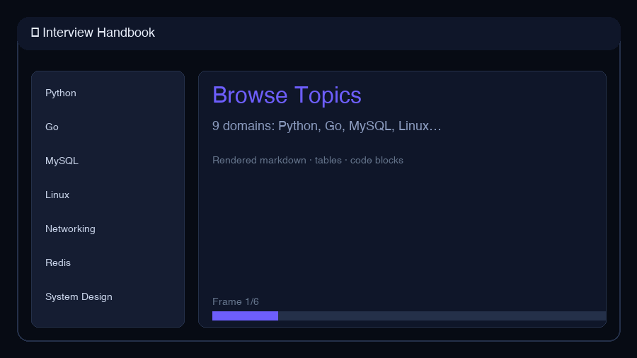

# Software Engineering Interview Handbook

<p align="center">
  
</p>

<p align="center">
  <strong>The backend & infra interview prep repo that actually ships a UI.</strong><br/>
  9 topic domains · English · tables & code · local preview server · zero database.
</p>

<p align="center">
  <a href="#-live-preview">Live Preview</a> ·
  <a href="#-topics">Topics</a> ·
  <a href="#-use-cases">Use Cases</a> ·
  <a href="#-quick-start">Quick Start</a> ·
  <a href="CHANGELOG.md">Changelog</a>
</p>

<p align="center">
  
  
  
  
</p>

---

## Why this repo?

Most interview repos are a wall of markdown you scroll forever. This one is **structured, cross-linked, and browsable** — clone it, run one command, study with a proper UI.

| Pain point | What you get here |
|------------|-------------------|
| "I don't know where to start" | 9 curated domains with TOC in every file |
| "Reading raw `.md` on GitHub is painful" | Dark-mode **web preview** with search + rendered tables |
| "Content was Chinese-only" | Fully translated English, expanded scope |
| "TCP vs OS vs networking overlap confuses me" | Cross-linked topics — same concept, different angles |
| "I need something for my portfolio README" | GIF demo + `make serve` — show, don't tell |
| "I want to contribute without breaking links" | `make check-links` CI-friendly link validator |

---

## Live Preview

```bash
git clone https://github.com/Francis1998/interview.git
cd interview
pip install -r requirements-dev.txt   # fastapi + uvicorn (~15s)
make serve
```

Open **http://127.0.0.1:8080** — sidebar navigation, live markdown rendering, topic search.

<p align="center">
  
</p>

<details>
<summary><strong>Preview server endpoints</strong></summary>

| Endpoint | Description |
|----------|-------------|
| `GET /` | Web UI |
| `GET /api/topics` | List all topics |
| `GET /api/topics/{id}` | Raw markdown JSON |
| `GET /health` | Health check |

</details>

---

## Use Cases

### Studying for a backend loop
You're interviewing at a company that hits Python + MySQL + system design. Open the preview, filter **Python** → GIL section, then **MySQL** → B+ tree indexes, then **System Design** → caching patterns. One repo, no context switching.

### Last-minute networking refresh
```bash
make serve
# Click Networking → TCP three-way handshake, TIME_WAIT, HTTP/2 vs HTTP/3
```

### Go / infra role prep
**golang.md** covers goroutines, GC phases, GMP model, channels, memory allocator — with diagrams in `golang.assets/`.

### Offline on a flight
Clone once. All content is static markdown — no API keys, no network after clone.

### Contributing a new section
1. Add/edit a topic `.md` file  
2. `make check-links`  
3. PR — preview server picks it up automatically if registered in `scripts/serve.py`

---

## Topics

| | Topic | File | Highlights |
|---|-------|------|------------|
| 🐍 | Python | [python.md](./python.md) | GIL, memory, coroutines, decorators |
| 🔵 | Go | [golang.md](./golang.md) | Goroutines, GC, channels, CSP |
| 🗄️ | MySQL | [mysql.md](./mysql.md) | InnoDB, B+ tree, ACID, EXPLAIN |
| 🐧 | Linux | [linux.md](./linux.md) | epoll, diagnostics, signals |
| 🌐 | Networking | [networking.md](./networking.md) | TCP/UDP, HTTP/TLS, DNS, CDN |
| ⚙️ | OS | [operating-systems.md](./operating-systems.md) | Processes, IPC, kernel mode |
| 🔴 | Redis | [redis.md](./redis.md) | Single-thread, LRU, eviction |
| 📊 | Algorithms | [algorithms.md](./algorithms.md) | Sort, heap, top-K, red-black tree |
| 🏗️ | System Design | [system-design.md](./system-design.md) | CAP, sharding, rate limiting |

---

## Quick Start

```bash
# Browse locally (recommended)
make serve

# Or read markdown directly
cat python.md
make list          # all topic files
make check-links   # validate cross-links
make demo-gif      # regenerate README GIF
```

---

## Project layout

```
interview/
├── demo/              # Web preview UI (HTML/CSS/JS)
├── scripts/
│   ├── serve.py       # FastAPI preview server
│   ├── check_links.py # Link validator
│   └── generate_demo_gif.py
├── assets/
│   └── demo-handbook.gif
├── python.md … system-design.md   # 9 topic handbooks
└── golang.assets/                 # Go GC diagrams
```

---

## Roadmap

- [x] English translation + expanded scope
- [x] Web preview server + demo GIF
- [ ] Kubernetes / cloud-native section
- [ ] Distributed systems (consensus, MQ)
- [ ] Behavioral interview templates

See [CHANGELOG.md](./CHANGELOG.md).

---

## Contributing

PRs welcome — new questions, clearer explanations, diagram improvements. Run `make check-links` before submitting.

---

## License

Educational use. External links and diagrams retain original attribution.
